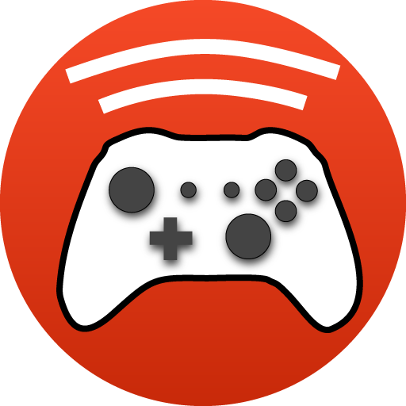
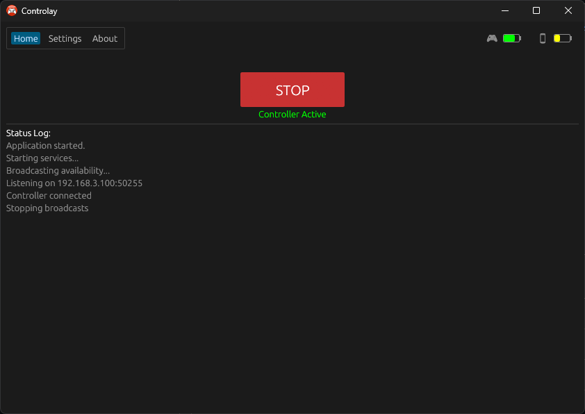
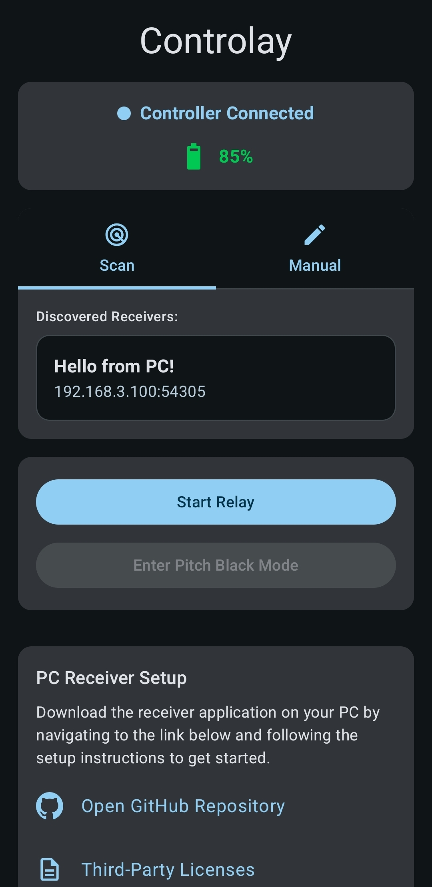

# Controlay

  

  
  
  

This is the receiver application for the **Controlay** Android app. You'll need both to get started!

  

## About
Controlay allows you to use your Android phone as a wireless bridge, relaying input from a Bluetooth game controller directly to your PC. This repository contains the **Windows PC Receiver**. The source code for the Android companion app can be found [here](https://github.com/arounre/controlay-android).

  <table align="center">
    <tr>
      <td align="center" width="60%">
         
        <b>PC Receiver</b>
      </td>
      <td align="center" width="30%">
         
        <b>Android App</b>
      </td>
    </tr>
  </table>

## Why Does This Exist?
Many PCs (especially desktops or older laptops) lack built-in Bluetooth support, requiring a bluetooth dongle to use wireless controllers. Controlay eliminates that need by using your Android phone's Bluetooth capabilities and relaying that connection over your local network, to your PC.

## Features
- **Broad Controller Compatibility**: Likely (🤞) to work with most Bluetooth controllers that are able to pair with Android devices.
- **Flexible Emulation Modes**: Choose to emulate a PlayStation 4 DualShock 4 or Xbox 360 (XInput) controller on the PC side for maximum game compatibility.
- **Seamless Local Network Connection**: Connecting your phone to your PC is effortless and requires no manual configuration. Simply ensure both devices are on the same Wi-Fi network, select your PC from the app, and tap "Start Relay." There's no pairing handshake yet, so use it on a Wi-Fi you trust (e.g. home), not a public hotspot. Latency and performance depend on the quality of your Wi-Fi environment.

## Usage
Follow these steps to set up the system.

1.  **Install the Controlay App on your Android Device**

    Download the APK from the [Controlay Android Releases](https://github.com/arounre/controlay-android/releases) page. Connect your controller to the phone via Bluetooth.

2.  **Install the ViGEmBus Driver on your PC**

    This driver is essential for emulating the virtual controller.
    *   Download the latest setup from the [ViGEmBus releases page](https://github.com/nefarius/ViGEmBus/releases).
    *   Run the installer and follow the on-screen instructions.

3.  **Download and Run the Receiver on your PC**

    You can grab the latest version from the [**Releases Tab**](https://github.com/arounre/controlay/releases). Binaries and setups are provided for the most common Windows architectures:
    *   **`amd64` (or `x64`):** For most standard PCs with Intel or AMD processors.
    *   **`ARM64`:** For ARM devices, like the Surface Pro X.

4.  **Connect**

    Ensure your PC and Android device are on the same Wi-Fi network. Click "Start Broadcasting" and the receiver should now show up in the app.

## System Requirements
*   **OS:** Windows 10 or Windows 11 (64-bit or ARM64).
*   **Network:** PC and Android device on the same trusted local Wi-Fi (no pairing handshake yet).
*   **Driver:** [ViGEmBus](https://github.com/nefarius/ViGEmBus/releases).

## Troubleshooting

### The PC doesn't show up in the Android App
*   **Windows Firewall:** When you first run Controlay, Windows will ask for network permission. Ensure you allow access on **Public** and **Private** networks. If you missed this popup, check your Windows Defender Firewall settings.
*   **VPNs:** If you are using a VPN on either your phone or PC, disable it. VPNs often block local network discovery.
*   **Manual Connection:** If automatic discovery fails, you can try manually entering your PC's IP address and Port into the Android app.

### Controller input isn't registering in games
*   **Missing Driver:** Ensure you have installed the **ViGEmBus** driver linked in the Installation steps. The app cannot emulate a controller without it.
*   **Game Support:** Some games only support Xbox controllers. If you have "DualShock 4" selected in Controlay settings, try switching to "Xbox 360".

## Third-Party Libraries
This project utilizes several open-source libraries. A full list of these dependencies and their respective licenses can be found in the [thirdparty.md](./thirdparty.md) file.

## License
This project is licensed under the **GNU General Public License v3.0**. See the [LICENSE](./LICENSE) file for more details.
